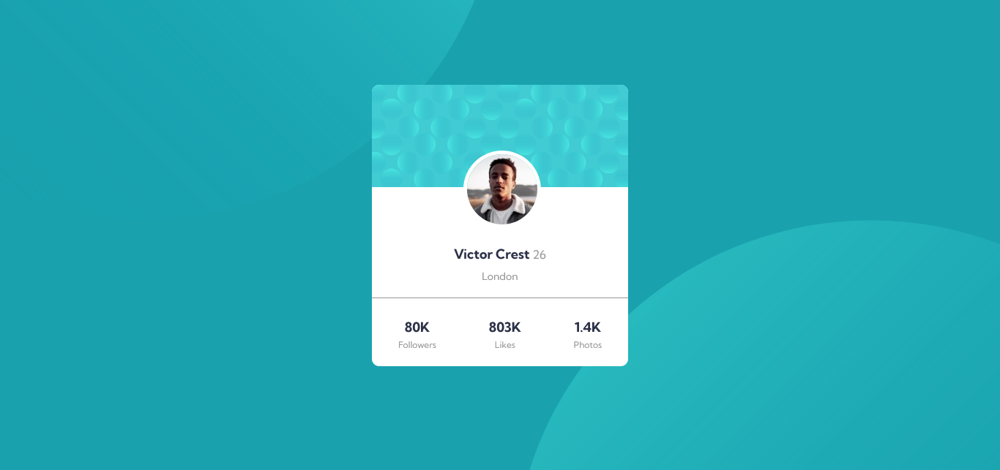

# Frontend Mentor - Profile-card-component
This is a solution to the [Profile card component on Frontend Mentor](https://www.frontendmentor.io/challenges/profile-card-component-cfArpWshJ). Frontend Mentor challenges help you improve your coding skills by building realistic projects.

## Overview

### The challenge

Users should be able to:

- View the optimal layout for the component depending on their device's screen size
- See the social media share links when they click the share icon

### Screenshot

- Desktop Screenshot

## My process

### Built with

- Semantic HTML5 markup
- CSS custom properties
- Flexbox

## Author

- Frontend Mentor - [@alkarim99](https://www.frontendmentor.io/profile/alkarim99)
- Twitter - [@a_alkarim_a](https://www.twitter.com/a_alkarim_a)
